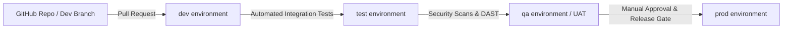

# 01 - Executive Summary: Zero-Trust Clinical Platform (Mortho)

## 1. Vision & Core Objectives

The **Mortho Zero-Trust Clinical Platform** is a specialized, cost-effective, high-assurance healthcare solution engineered for **≤ 3,000 active users**. It enables seamless and secure collaboration across four primary clinical and operational roles:
1. **`doctor`**: Attending orthopedic surgeons and consulting specialists.
2. **`staff`**: Physician assistants (PAs), scrub nurses, OR coordinators, and clinic administrative staff.
3. **`patient`**: Surgical patients managing pre-op preparation, recovery goals, and clinical communication.
4. **`manufacturer`**: Medical device and implant engineers managing custom 3D CAD jigs, plates, screws, and sterilization logistics.

```mermaid
graph TD
    subgraph Roles["4 Core Platform Roles (<= 3,000 Users)"]
        R1[doctor]
        R2[staff]
        R3[patient]
        R4[manufacturer]
    end

    subgraph GitHub_DevOps["GitHub CI/CD Environments"]
        ENV1[dev] --> ENV2[test] --> ENV3[qa] --> ENV4[prod]
    end

    subgraph Edge["Cloudflare Anycast Perimeter (Cost-Effective Tier)"]
        CF[Cloudflare Edge / WAF / Turnstile / API Shield]
        CFT[Cloudflare Tunnel (cloudflared.exe)]
    end

    subgraph Host["Right-Sized Google Cloud VM (Windows + MSSQL)"]
        BFF[.NET 10 ASP.NET Core BFF + YARP Proxy]
        API[.NET 10 Core Orthopedic API]
        SQL[(Microsoft SQL Server 2022 + TDE via KMS)]
    end

    subgraph Identity["Identity Authority"]
        FA[FusionAuth IdP (DPoP + Passkeys + SAML SSO)]
    end

    subgraph RealTime["Real-Time Collaboration"]
        SC[Stream Chat HIPAA Messaging]
    end

    Roles -->|HTTPS TLS 1.3| CF
    CF -->|Outbound QUIC Tunnel| CFT
    CFT --> BFF
    BFF <-->|DPoP Proofs| API
    API <-->|Shared Memory LPC (<0.2ms)| SQL
    BFF <-->|PAR / Private Key JWT| FA
    Roles <-->|Bi-directional WebSockets| SC
```

---

## 2. Primary Strategic Mandates

### 1. Complete Decommissioning & Replacement of ASP.NET Zero
- **Eliminate Monolithic Baggage**: Remove bloated legacy ABP boilerplate, complex unmaintainable permission tables, and heavy monolithic abstractions.
- **Eliminate Client-Side Token Leaks**: Replace client-side JWT storage (`localStorage`/`sessionStorage`) with the **Backend-for-Frontend (BFF)** pattern. Browsers only hold encrypted, `HttpOnly`, `SameSite=Strict` `__Host-` session cookies.
- **Implement Modern ReBAC**: Enforce high-performance Relationship-Based Access Control (`CaseAccessGrants`) specifically tailored to surgical cases and clinical rosters.

### 2. Zero-Trust Architecture Passing Pentest.com Standard Testing
- Engineered to pass third-party penetration testing across Web, Mobile, and Desktop platforms on **Windows, Ubuntu/Linux, macOS, iOS (iPhone), and Android**.
- Defeats OWASP Top 10 Web (2021) and OWASP Mobile Top 10 (2024) attack vectors.
- **Origin Cloaking**: Zero open inbound firewall ports on the host VM (ports 80, 443, 1433, 3389 are closed; ingress is handled via an outbound-initiated Cloudflare Tunnel).
- **DPoP Sender Constraining (RFC 9449)**: Prevents intercepted tokens from being replayed on downstream APIs without the matching private key.

### 3. Right-Sized & Cost-Conscious Infrastructure (≤ 3,000 Users)
- Sized for high performance with minimal monthly operational overhead.
- Single right-sized Google Compute Engine (GCE) VM co-locating the .NET 10 BFF, Core API, and Microsoft SQL Server 2022.
- Inter-process communication operates via local **Shared Memory (`LPC`)**, delivering sub-millisecond query execution without expensive multi-tier networking costs.

---

## 3. Technology Stack & Multi-Environment DevOps Pipeline

| Layer | Selected Technology | Rationale & Scope |
| :--- | :--- | :--- |
| **Backend & BFF** | **.NET 10 (ASP.NET Core)** | High-performance runtime, native AOT capabilities, YARP reverse proxy, DPoP token handlers. |
| **Web UI (Browser)** | **Angular (v19+)** | High-density desktop workstation portal (OR timeline scheduling, virtualized grids, PDF signing). |
| **Mobile & Desktop UI** | **Flutter** | Single cross-platform codebase for iOS (iPhone/iPad), Android, Windows, macOS, and Ubuntu/Linux. |
| **Identity Authority** | **FusionAuth** | Multi-tenant OIDC/OAuth 2.0 provider, Passkeys/WebAuthn, hospital SSO, and DPoP-bound token issuance. |
| **Database Engine** | **Microsoft SQL Server 2022** | Co-located on NVMe storage; communicates via Shared Memory (`LPC`); TDE encrypted via Cloud KMS. |
| **Perimeter Security** | **Cloudflare Anycast & Tunnel** | Origin cloaking, WAF OWASP rules, Turnstile bot challenges, API Shield rate limiting. |
| **Real-Time Chat** | **Stream Chat (HIPAA Tier)** | Case channels, doctor-patient messaging, implant engineering threads, APNs/FCM push alerts. |
| **CI/CD & DevOps** | **GitHub Actions & Environments** | Automated testing and deployment pipeline for **`dev`**, **`test`**, **`qa`**, and **`prod`**. |

---

## 4. GitHub Environment Pipeline (`dev` -> `test` -> `qa` -> `prod`)



1. **`dev` Environment**: Local developers and branch previews; automated unit tests and linter checks on every pull request.
2. **`test` Environment**: Automated integration testing verifying BFF session flows, DPoP token handshakes, and ReBAC filter evaluations.
3. **`qa` Environment**: Staging environment for clinical user acceptance testing (UAT), mock hospital SSO login, and automated DAST penetration scans.
4. **`prod` Environment**: Production deployment on Google Cloud with Cloudflare Tunnel ingress, strict KMS TDE, and audit log ingestion.

---

## 5. Documentation Suite Index

- [01-executive_summary.md](file:///e:/Github/Damienbod/Auth0BffDpopApi/docs/01-executive_summary.md): **Executive Vision, 4 Roles, Architecture Mapping & Sizing** (This Document).
- [02a-cloudflare_work_effort.md](file:///e:/Github/Damienbod/Auth0BffDpopApi/docs/02a-cloudflare_work_effort.md): **Cloudflare Edge, Cloudflare Tunnel (`cloudflared`), WAF, API Shield & Origin Cloaking**.
- [02b-google_cloud_work_effort.md](file:///e:/Github/Damienbod/Auth0BffDpopApi/docs/02b-google_cloud_work_effort.md): **GCE VM Deployment, Windows/SQL Image Setup, Cloud KMS TDE, GCS v4 Pre-signed URLs & IAP**.
- [02c-fusionauth_identity_work_effort.md](file:///e:/Github/Damienbod/Auth0BffDpopApi/docs/02c-fusionauth_identity_work_effort.md): **FusionAuth Identity Provider, DPoP Issuance, Passkeys/WebAuthn, Hospital SSO & Lambdas**.
- [02d-stream_chat_realtime_work_effort.md](file:///e:/Github/Damienbod/Auth0BffDpopApi/docs/02d-stream_chat_realtime_work_effort.md): **HIPAA Real-Time Communication, Care Team Messaging Channels & APNs/FCM Push Notifications**.
- [02e-database_storage_work_effort.md](file:///e:/Github/Damienbod/Auth0BffDpopApi/docs/02e-database_storage_work_effort.md): **SQL Server on NVMe, Shared Memory LPC Transport, Cloud KMS TDE, EF Core ReBAC & Audit Trails**.
- [03-application_coding_detailed.md](file:///e:/Github/Damienbod/Auth0BffDpopApi/docs/03-application_coding_detailed.md): **Application Implementation Steps (.NET 10 BFF, YARP, Angular Web & Flutter Cross-Platform)**.
- [04-pentest_compliance_verification.md](file:///e:/Github/Damienbod/Auth0BffDpopApi/docs/04-pentest_compliance_verification.md): **Pentest.com Audit Checklist across Web, Mobile, Desktop (Windows, Linux, macOS, iOS, Android)**.
- [05-implementservice.md](file:///e:/Github/Damienbod/Auth0BffDpopApi/docs/05-implementservice.md): **Service Implementation Roadmap & Phased Execution Plan (What to Build 1st, 2nd, etc.)**.
- [ClientRegistration&WorkFlows.md](file:///e:/Github/Damienbod/Auth0BffDpopApi/docs/ClientRegistration&WorkFlows.md): **Client Registration Specifications & Clinician Onboarding Workflows**.
