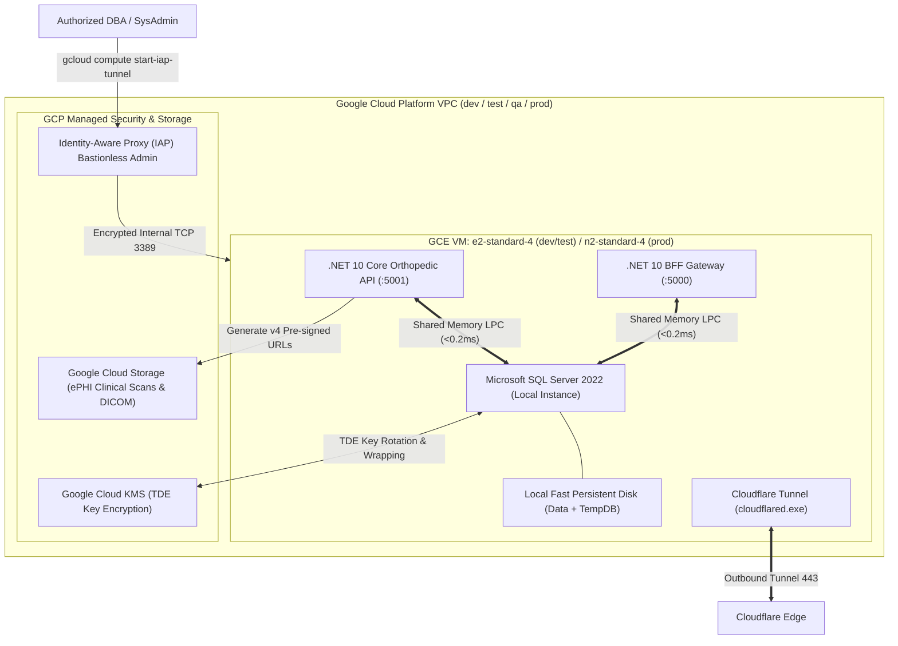

# 02b - Google Cloud Work Effort: GCE Host, SQL Server NVMe, Cloud KMS TDE, GCS & IAP

## 1. Overview & Cloud Architecture (Right-Sized for ≤ 3,000 Users)

To maintain lean cloud expenditures while ensuring sub-millisecond query performance and zero-trust security, the platform utilizes a consolidated **Google Compute Engine (GCE)** host architecture. In production, a single optimized instance co-locates Windows Server, Microsoft SQL Server 2022, the .NET 10 BFF, and Core API.



---

## 2. VM Sizing & Cost-Effective Environment Profiles

For a user base of **≤ 3,000 users** (with typically 50–200 concurrent active users), infrastructure is right-sized across environments:

| Environment | GCE Machine Type | vCPU / RAM | Disk Configuration | Estimated Monthly Role |
| :--- | :--- | :--- | :--- | :--- |
| **`dev`** | `e2-medium` / Local Container | 2 vCPU / 4 GB | 50 GB pd-standard | Developer sandbox & GitHub Actions PR builds |
| **`test`** | `e2-standard-2` | 2 vCPU / 8 GB | 80 GB pd-balanced | Automated integration and regression tests |
| **`qa`** | `e2-standard-4` | 4 vCPU / 16 GB | 100 GB pd-balanced | Staging UAT, hospital SSO validation, DAST scans |
| **`prod`** | `n2-standard-4` | 4 vCPU / 16 GB | 150 GB pd-ssd (NVMe) | Live production for doctor, staff, patient, manufacturer |

---

## 3. SQL Server Shared Memory (`LPC`) Inter-Process Communication

Co-locating SQL Server with the .NET 10 backend on the same VM host eliminates TCP/IP stack overhead and socket serialization latency.

### Implementation Steps
1. **Enable Shared Memory Protocol**: In SQL Server Configuration Manager, ensure Shared Memory is enabled and ordered first before TCP/IP.
2. **Connection String in `appsettings.Production.json`**:
   ```json
   {
     "ConnectionStrings": {
       "MorthoClinicalDb": "Server=(local);Database=MorthoClinical;Integrated Security=true;TrustServerCertificate=true;Max Pool Size=100;Application Name=MorthoBffCore;"
     }
   }
   ```
3. **Verification**: Executing `SELECT net_transport FROM sys.dm_exec_connections WHERE session_id = @@SPID;` returns `Shared memory` with query latency < 0.2ms.

---

## 4. Transparent Data Encryption (TDE) via Google Cloud KMS

All database files (`.mdf`, `.ldf`, `.ndf`, and `TempDB`) are encrypted at rest using SQL Server TDE backed by a key wrapped with Google Cloud KMS.

### Implementation Steps
1. Create a Key Ring and Asymmetric Key in Google Cloud KMS (`mortho-tde-keyring / mortho-sql-tde-key`).
2. Create the Database Master Key and Server Certificate in SQL Server `master` database.
3. Generate the Database Encryption Key (DEK) using AES-256 algorithm on the `MorthoClinical` database.
4. Enable TDE on the database: `ALTER DATABASE MorthoClinical SET ENCRYPTION ON;`.

---

## 5. Google Cloud Storage (GCS) & v4 Pre-Signed URLs for Clinical Scans

Clinical assets (X-rays, DICOM slices, 3D implant CAD models, and operative note PDFs) are stored in encrypted Google Cloud Storage buckets rather than consuming database storage.

### Implementation Steps
1. The client requests access to a clinical scan (`GET /api/v1/cases/{caseId}/scans/{scanId}`).
2. The Core API validates that the calling user (`doctor`, `staff`, `patient`, or `manufacturer`) holds an active ReBAC grant for the case.
3. The Core API invokes the Google Cloud Storage SDK to generate a **v4 Pre-Signed URL** with a strictly limited 10-minute expiration.
4. The Angular or Flutter UI downloads/renders the image directly from GCS, offloading bandwidth from the application VM.

---

## 6. Bastionless Administration via Google Identity-Aware Proxy (IAP)

To maintain a zero-inbound-port security posture:
- Inbound firewall ports (3389 for RDP and 1433 for SQL Server) are **closed** on the public internet.
- Administrators connect to Windows Server RDP and SQL Server Management Studio (SSMS) exclusively through an encrypted **Google IAP TCP Tunnel** requiring Google Workspace IAM authentication and FIDO2 MFA:
  ```powershell
  # Open local tunnel on workstation port 33890 for RDP
  gcloud compute start-iap-tunnel mortho-prod-vm 3389 --local-host-port=localhost:33890 --zone=us-central1-a
  ```
