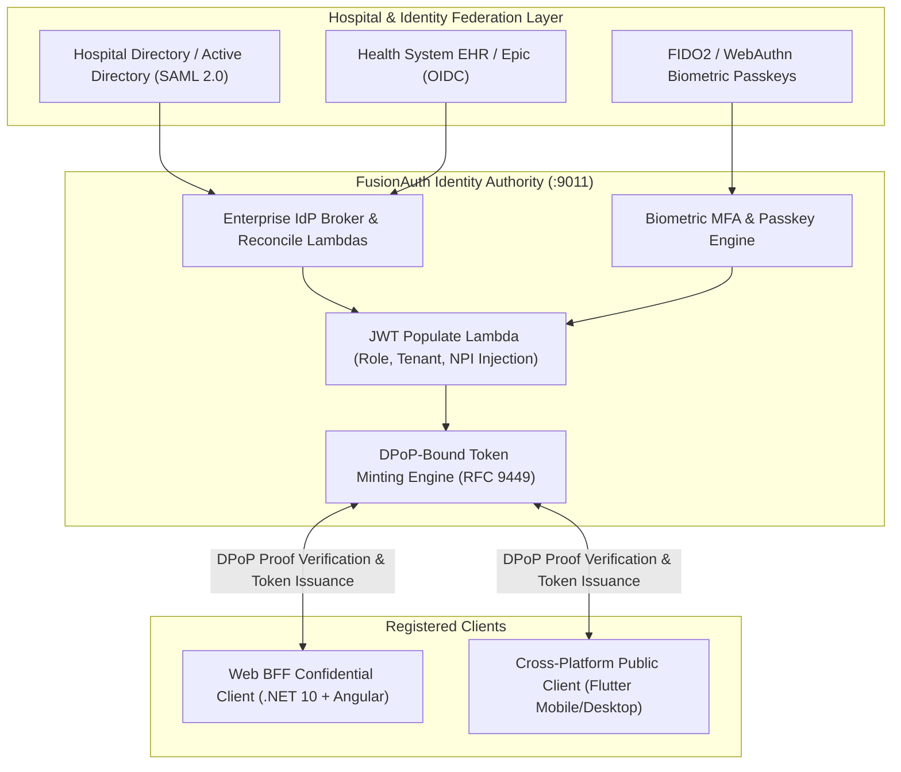

# 02c - FusionAuth Work Effort: Zero-Trust Identity, DPoP, Passkeys & Enterprise SSO

## 1. Overview & Identity Strategy (4 Core Roles)

FusionAuth serves as the central OIDC & OAuth 2.0 Identity Provider (IdP) for the Mortho clinical platform, replacing the legacy ASP.NET Zero user/tenant management subsystems. Sized for **≤ 3,000 users**, it manages authentication across the 4 core platform roles:
1. **`doctor`**: Orthopedic surgeons and attending physicians.
2. **`staff`**: PAs, scrub techs, OR nurses, and clinic administrators.
3. **`patient`**: Surgical patients accessing perioperative care plans.
4. **`manufacturer`**: Medical device and implant engineers.



---

## 2. FusionAuth Client Applications Configuration

### A. Web Application BFF Client (Confidential Client)
- **Role:** Web application backend host for Angular workstations.
- **Client Type:** Confidential.
- **Grant Types:** `authorization_code`, `refresh_token`.
- **PKCE:** Mandatory (`S256`).
- **Client Authentication:** Private Key JWT (`urn:ietf:params:oauth:client-assertion-type:jwt-bearer`) or Secure Backend Secret.
- **Redirect URIs (Multi-Environment)**:
  - `dev`: `https://localhost:5001/callback`
  - `test`: `https://test-portal.morthoclinical.com/callback`
  - `qa`: `https://qa-portal.morthoclinical.com/callback`
  - `prod`: `https://portal.morthoclinical.com/callback`

### B. Cross-Platform Flutter Client (Public Client)
- **Role:** Flutter client deployed on iOS, Android, Windows, macOS, Ubuntu/Linux.
- **Client Type:** Public (No embedded client secret in binary distributions).
- **Grant Types:** `authorization_code`, `refresh_token`.
- **PKCE:** Mandatory (`S256`).
- **Redirect URIs:** `mortho://oauth/callback`
- **DPoP Enforcement:** Enabled (Requires DPoP Proof signed inside device Secure Enclave).

---

## 3. FusionAuth Lambdas (Token Enrichment & Reconciliation)

### 3.1 JWT Populate Lambda
Executed prior to minting the Access Token. Injects tenant IDs, clinical metadata, and standardizes user roles into one of the 4 platform roles (`doctor`, `staff`, `patient`, `manufacturer`):

```javascript
function populate(jwt, user, registration) {
  // Inject Tenant & Organization Boundary
  jwt.tenant_id = registration.tenantId;
  
  // Inject Clinical Metadata (if applicable)
  jwt.npi = user.data ? user.data.npiNumber : null;
  jwt.hospital_id = user.data ? user.data.hospitalAffiliationId : null;
  
  // Standardize into 4 core roles: 'doctor', 'staff', 'patient', 'manufacturer'
  jwt.roles = registration.roles || [];
  
  jwt.origin_auth = 'FusionAuth-ZeroTrust';
  jwt.mortho_tier = registration.data ? registration.data.tier : 'standard';
}
```

### 3.2 Enterprise SSO Reconcile Lambda
Executed during SAML 2.0 or OIDC federated login from hospital networks. Maps incoming hospital Active Directory or Epic groups to Mortho roles:

```javascript
function reconcile(user, idpResponse) {
  user.email = idpResponse.email;
  user.firstName = idpResponse.firstName;
  user.lastName = idpResponse.lastName;
  
  var groups = idpResponse.rawUserInfo['groups'] || [];
  user.data = user.data || {};
  
  if (groups.indexOf('Ortho_Attending_Surgeons') !== -1) {
    user.data.npiNumber = idpResponse.rawUserInfo['npi'];
    user.data.clinicalRole = 'doctor';
  } else if (groups.indexOf('Ortho_Surgical_Staff') !== -1) {
    user.data.clinicalRole = 'staff';
  } else if (groups.indexOf('Device_Vendor_Reps') !== -1) {
    user.data.clinicalRole = 'manufacturer';
  }
}
```

---

## 4. Clinician & User Onboarding Workflow

1. **Invitation Trigger**: A Clinic Administrator (`staff` or `doctor`) creates a new user profile via the Mortho Web UI.
2. **API Registration**: The .NET 10 Core API calls FusionAuth's REST API (`POST /api/user/registration`) using an administrative API key.
3. **Biometric Activation**: FusionAuth sends an invitation email containing a secure link for the user to register their FIDO2 Passkey / WebAuthn biometric credential.
