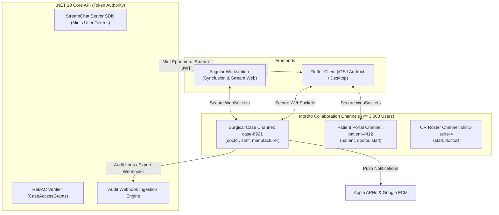

# 02d - Stream Chat Work Effort: HIPAA Real-Time Messaging & Multi-Stakeholder Collaboration

## 1. Overview & Collaboration Topology (4 Platform Roles)

Orthopedic surgical care requires real-time, HIPAA-compliant collaboration across the four primary platform roles (**`doctor`**, **`staff`**, **`patient`**, and **`manufacturer`**). Stream Chat powers all real-time case discussions, pre-op planning threads, recovery check-ins, and on-call OR alerts.

---

## 2. Channel Architecture Across the 4 Roles

| Channel Type | Participants | Collaborative Workflow |
| :--- | :--- | :--- |
| **`case-surgical-team`** | `doctor`, `staff`, `manufacturer` | Surgical approach review, custom 3D implant jigs, screw sizes, instrument trays, and sterile delivery logistics. |
| **`patient-recovery`** | `patient`, `doctor`, `staff` | Post-operative wound checks, active range-of-motion progress, pain score check-ins, and rehab milestones. |
| **`clinic-or-broadcast`** | `staff`, `doctor` | Real-time OR room status, surgical turnover alerts, emergency trauma add-ons. |
| **`manufacturer-cad-review`** | `doctor`, `manufacturer` | High-fidelity discussion of patient-specific 3D CT reconstructions and custom plate pre-bending specs. |

---

## 3. Server-Side Token Generation & Role Synchronization

Clients never generate Stream Chat tokens directly. The .NET 10 backend validates the user's DPoP-authenticated session and mints an ephemeral Stream user token:

1. **Authentication Verification**: Core API extracts the user ID (`sub`) and role (`doctor`, `staff`, `patient`, `manufacturer`) from the verified token.
2. **User Record Upsert**: The backend synchronizes the user profile and role metadata with Stream Chat.
3. **Token Minting**: The server signs a short-lived Stream Chat JWT (valid for 1 hour) using the Stream API secret.
4. **ReBAC Channel Access Guard**: When a user attempts to join a case channel (`case-8921`), the backend verifies active `CaseAccessGrants` before authorizing membership.

---

## 4. Push Notification Delivery (Apple APNs & Google FCM)

For on-call orthopedic surgeons (`doctor`) and surgical staff (`staff`):
- **HIPAA-Safe Redaction**: Lock screen notifications display redacted text without raw ePHI (e.g., *"New update in Case #8921. Open Mortho with Face ID to review."*).
- **Device Registration**: The Flutter client automatically registers APNs/FCM tokens upon biometric login.
