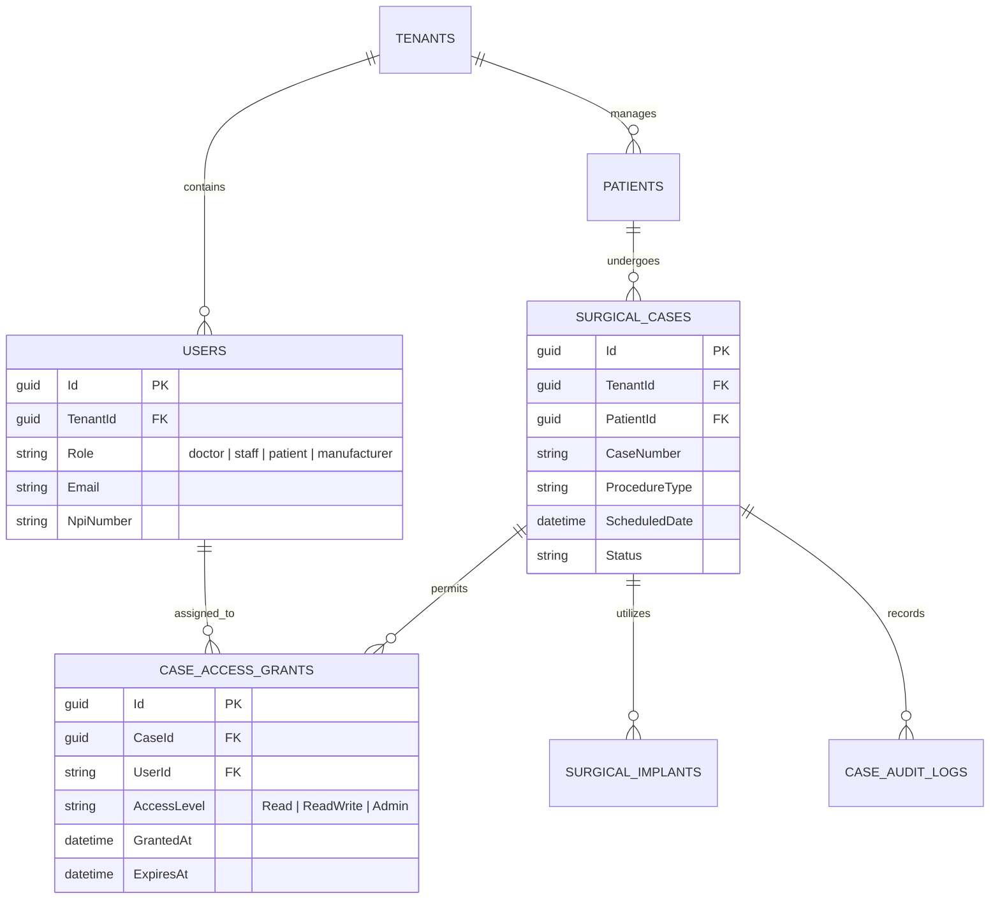

# 02e - Database & Storage Work Effort: Microsoft SQL Server, Shared Memory LPC, TDE & EF Core ReBAC

## 1. Overview & High-Performance Architecture (≤ 3,000 Users)

The Mortho clinical data layer centers on **Microsoft SQL Server 2022** co-located directly on the Windows Server GCE host. By utilizing local SSD storage and the **Shared Memory (`LPC`) protocol**, the .NET 10 backend achieves sub-millisecond query execution speeds without network serialization overhead, while maintaining full compliance via **Transparent Data Encryption (TDE)** and **EF Core ReBAC** for the 4 core platform roles (**`doctor`**, **`staff`**, **`patient`**, **`manufacturer`**).



---

## 2. Storage Tuning & Right-Sized Resource Allocation

To handle concurrent surgical timelines and DICOM metadata indexing for ≤ 3,000 users:
1. **Disk Layout**: Single 150 GB fast persistent disk (SSD) formatted with **64 KB Block Allocation Unit Size**.
2. **TempDB Configuration**: 4 TempDB data files (matching 4 vCPUs on `n2-standard-4` prod VM) with equal sizing and `AUTOGROW = 64MB`.
3. **Connection Efficiency**: Max pool size set to 100 connections in .NET 10 DbContext pooling.

---

## 3. Entity Framework Core (.NET 10) ReBAC Architecture

Global query filters guarantee that data queries never leak records across tenants or unauthorized cases:

1. **`doctor` Filter**: Doctors only query cases where they are the primary surgeon or hold an active grant in `CaseAccessGrants`.
2. **`staff` Filter**: Clinical staff can query all surgical cases within their assigned hospital tenant.
3. **`patient` Filter**: Patients can only query their own surgical records (`PatientId == User.PatientId`).
4. **`manufacturer` Filter**: Manufacturer representatives can only query implant specifications and 3D CAD files for cases explicitly assigned to their vendor ID.

---

## 4. Immutable Clinical Audit Trail Table

Every read, export, update, and signature capture generates an append-only audit record in SQL Server:

```sql
CREATE TABLE dbo.CaseAuditLogs (
    Id UNIQUEIDENTIFIER NOT NULL DEFAULT NEWSEQUENTIALID() PRIMARY KEY CLUSTERED,
    TenantId UNIQUEIDENTIFIER NOT NULL,
    CaseId UNIQUEIDENTIFIER NOT NULL,
    UserId NVARCHAR(128) NOT NULL,
    UserRole NVARCHAR(32) NOT NULL, -- 'doctor', 'staff', 'patient', 'manufacturer'
    UserNpi NVARCHAR(32) NULL,
    Action NVARCHAR(64) NOT NULL,
    ClientIp NVARCHAR(64) NOT NULL,
    DPoPThumbprint NVARCHAR(128) NOT NULL,
    TimestampUtc DATETIME2(3) NOT NULL DEFAULT SYSUTCDATETIME(),
    DetailsJson NVARCHAR(MAX) NULL
);

-- Deny UPDATE and DELETE to ensure tamper-proof audit trail
DENY UPDATE, DELETE ON dbo.CaseAuditLogs TO [MorthoAppUser];
```

---

## 5. Automated Backup & HIPAA Retention Policy

- **Full Backups**: Daily at 01:00 UTC using native SQL Server AES-256 encryption.
- **Transaction Log Backups**: Every 30 minutes (RPO < 30 mins, RTO < 1 hour).
- **Archival**: Automated PowerShell script transfers encrypted backups to Google Cloud Storage Coldline with a **7-year WORM retention lock**.
