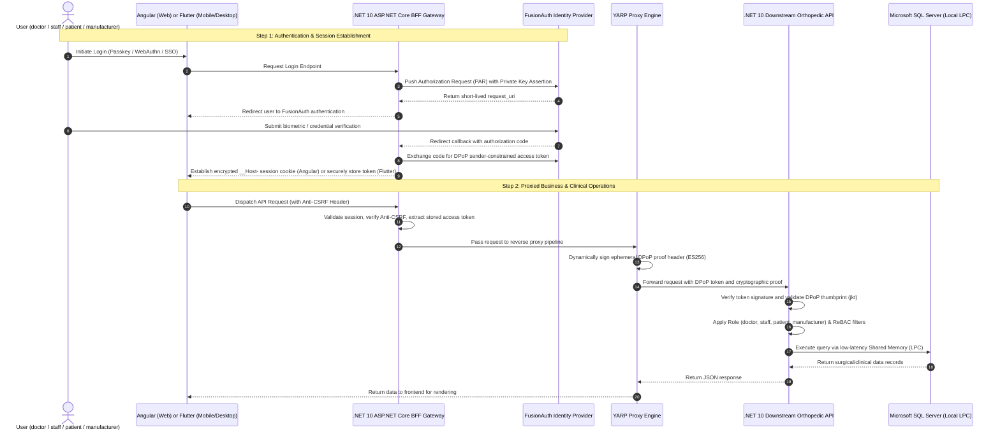

# 03 - Application Architecture & Implementation Steps: ASP.NET Core (.NET 10) BFF, YARP, Angular & Flutter

## 1. Architectural Overview & System Flow

The Mortho clinical system is built with a **.NET 10** backend utilizing the **Backend-for-Frontend (BFF)** pattern with **YARP (Yet Another Reverse Proxy)**. It serves two dedicated frontend layers:
- **Angular (Browser UI):** Optimized for clinical desktops and workstations (operating room scheduling, operative notes, and records).
- **Flutter (Cross-Platform Mobile & Desktop):** Compiled for iOS, Android, Windows, macOS, and Ubuntu/Linux (bedside rounds, recovery tracking, on-call alerts).

The system supports four distinct user roles across all environments (**dev**, **test**, **qa**, **prod**):
1. **`doctor`**: Attending orthopedic surgeons and consulting physicians.
2. **`staff`**: Physician assistants, scrub nurses, OR coordinators, and clinic administrative staff.
3. **`patient`**: Individuals undergoing surgery and post-operative physical therapy.
4. **`manufacturer`**: Medical device and custom implant representatives/engineers.

---

## 2. BFF Gateway Implementation Steps (.NET 10 & YARP)

Instead of exposing internal APIs directly to browsers, the ASP.NET Core BFF gateway acts as the secure reverse-proxy intermediary.

### Step 1: Session Cookie Architecture & Hardening
- Configure ASP.NET Core Cookie Authentication using the `__Host-` prefix (`__Host-mortho-session`).
- Enforce strict cookie security policies:
  - `HttpOnly`: Completely blocks JavaScript access, eliminating token theft via Cross-Site Scripting (XSS).
  - `SameSite = Strict`: Prohibits cross-origin cookie attachment on third-party site navigations.
  - `SecurePolicy = Always`: Restricts cookie transmission strictly to HTTPS connections.
  - `SlidingExpiration = true` with a right-sized 60-minute inactivity timeout.

### Step 2: OpenID Connect & PAR Integration with FusionAuth
- Register OpenID Connect middleware configured for Authorization Code Flow with PKCE (`S256`).
- Implement Pushed Authorization Requests (PAR): The BFF pushes all authorization parameters server-to-server to FusionAuth prior to redirecting the user's browser, preventing query string parameter tampering.
- Authenticate the confidential BFF client using Private Key JWT (RFC 7523) with an RSA-2048 signing certificate, eliminating static client secrets.

### Step 3: DPoP Token Lifecycle & Sender Constraining
- Integrate token management services to hold user Access Tokens and Refresh Tokens securely in server-side session memory.
- Configure an ECDSA P-256 (`ES256`) key generator to create ephemeral DPoP (Demonstrating Proof of Possession) proofs for every downstream request.
- Ensure automatic background token refresh when access tokens approach expiration.

### Step 4: YARP Reverse Proxy Transformation Pipeline
- Configure YARP routes mapping incoming frontend paths (such as `/api/v1/cases/**`, `/api/v1/implants/**`) to the downstream Core API cluster.
- Implement an automated YARP request transform that:
  1. Intercepts incoming user session state.
  2. Retrieves the sender-constrained access token from the session store.
  3. Signs a fresh DPoP proof HTTP header matching the exact HTTP verb (`GET`, `POST`, etc.) and target destination URL.
  4. Attaches `Authorization: DPoP <access_token>` and `DPoP: <proof_jwt>` headers to the outbound proxy request.
  5. Strips internal server routing headers to prevent internal infrastructure leakage.

### Step 5: Anti-CSRF Double-Defense Mechanism
- Implement global antiforgery token validation across all state-changing endpoints (`POST`, `PUT`, `DELETE`, `PATCH`).
- Require a custom `X-CSRF: 1` header on all proxied API calls from the Angular and Flutter clients.

---

## 3. Angular Web Workstation Implementation Steps (Desktop Workstations)

The Angular client is designed for high-density clinical workstations in hospital offices and surgical prep suites.

### Step 1: HTTP Interceptor Pipeline
- Implement a global HTTP interceptor that automatically attaches `withCredentials: true` to all outgoing requests so session cookies are included.
- Inject the required `X-CSRF: 1` header and `X-Requested-With: XMLHttpRequest` on all requests destined for the `/api/` prefix.
- Catch `401 Unauthorized` responses and initiate graceful session re-authentication without losing in-progress clinical forms.

### Step 2: Role-Based Routing & Workspace Guards
- Construct route guards that inspect the active user's role:
  - **`doctor` routes:** Case timeline scheduling, surgical approach planning, DICOM viewing, and operative note digital signing.
  - **`staff` routes:** Patient onboarding, OR room assignments, tray sterilization tracking, and surgical schedule management.
  - **`patient` routes:** Pre-op instruction checklists, consent reviews, and recovery questionnaire submission.
  - **`manufacturer` routes:** 3D CAD implant specs, screw tray checklists, and sterile delivery logistics.

### Step 3: Operating Room Timeline & Resource Scheduler
- Integrate the Syncfusion Angular Schedule component configured in `TimelineDay` and `TimelineWeek` modes.
- Group surgical cases horizontally by Operating Room suites (`OR 1`, `OR 2`, `OR 3`).
- Bind real-time data feeds to color-code cases by status (Scheduled, Pre-Op Prep, In-Surgery, Post-Op Recovery, Cleaned).

### Step 4: Operative Note Rich Editing & PDF Digital Signature Capture
- Embed rich text documentation tools allowing surgeons to quickly template operative findings.
- Utilize the Syncfusion PDF Viewer component to render the finalized operative summary.
- Capture handwritten stylus / mouse signatures directly over the PDF canvas and transmit the flattened, signed document to the BFF for archival to cloud storage.

---

## 5. Flutter Cross-Platform Client Implementation Steps (Mobile & Desktop)

The Flutter application provides a unified codebase deployed across **iOS, Android, Windows, macOS, and Ubuntu/Linux**.

### Step 1: Hardware-Backed Biometric Authentication & Secure Storage
- Utilize device biometric APIs (Face ID, Touch ID, Android Biometrics, Windows Hello) to unlock local application sessions.
- Store sensitive key pairs and refresh tokens inside the platform's native hardware keystore:
  - **iOS:** Keychain with `kSecAccessControlBiometryAny`.
  - **Android:** Android Keystore with hardware-backed encryption.
  - **Windows / macOS / Linux:** OS DPAPI and encrypted credential vaults.

### Step 2: Direct Mobile DPoP Proof Generator
- Because mobile applications are public clients, generate an ECDSA P-256 key pair inside the device hardware security enclave during first-time setup.
- On every outgoing API request to the backend, construct and sign an ephemeral DPoP proof JWT containing the current timestamp, target URL, and HTTP method.

### Step 3: Interactive Recovery & Range-of-Motion (ROM) Visualizations
- Implement Syncfusion Flutter Cartesian Chart modules to visualize patient rehabilitation milestones.
- Plot active vs. passive knee flexion/extension degrees over time against recovery benchmark curves.
- Allow patients to submit daily pain scores and recovery diary entries directly from their phones.

### Step 4: On-Call Notification & Deep Linking System
- Configure background notification handlers for Apple Push Notification Service (APNs) and Firebase Cloud Messaging (FCM).
- Parse incoming surgical schedule updates or manufacturer CAD revisions and deep-link clinicians directly to the relevant case channel or scan viewer.

---

## 6. Downstream Core API Implementation Steps (.NET 10)

The downstream Core Web API performs business processing, ReBAC enforcement, and data access.

### Step 1: DPoP Token Validation Middleware
- Validate standard JWT attributes (Issuer, Audience, Lifetime, Signature against FusionAuth JWKS).
- Verify the DPoP confirmation claim (`cnf.jkt`): Ensure the public key embedded in the incoming `DPoP` proof header matches the thumbprint bound to the access token.
- Validate proof freshness (rejecting proofs with timestamps older than 60 seconds) and check the HTTP method/URI claims to prevent token forwarding to unauthorized endpoints.

### Step 2: Relationship-Based Access Control (ReBAC) Engine
- Implement fine-grained access resolution based on surgical case assignments:
  - Verify if the calling `doctor` is the primary attending surgeon or an approved consultant on the requested case.
  - Verify if `staff` members are assigned to the clinical roster for the case's hospital tenant.
  - Verify that `patient` users can only read records tied directly to their personal `PatientId`.
  - Verify that `manufacturer` reps can only view implant specifications and CAD models for cases where their product is utilized.

### Step 3: Shared Memory Database Operations
- Configure Entity Framework Core 9/.NET 10 to communicate with the local Microsoft SQL Server instance using Shared Memory (`LPC`).
- Apply Global Multi-Tenant Query Filters at the `DbContext` level so data queries automatically filter by tenant and active case access grants.

### Step 4: Immutable Audit Trail Dispatch
- For every surgical case read, export, or status modification, emit an append-only audit event capturing the user ID, NPI, client IP, action name, and DPoP thumbprint.
