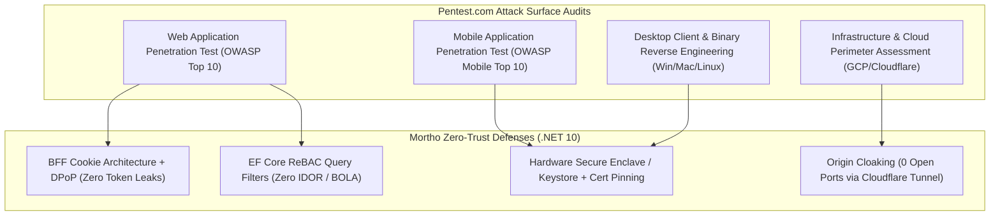

# 04 - Pentest.com & Zero-Trust Compliance Verification Matrix

## 1. Executive Security & Audit Validation

The Mortho platform is designed to pass rigorous third-party penetration testing protocols evaluated by leading security assurance firms (including **Pentest.com**, Mandiant, and Bishop Fox). This matrix covers security assertions across **Web (Angular), Mobile & Desktop (Flutter on Windows, Ubuntu/Linux, macOS, iOS, Android)** for all 4 roles (**`doctor`**, **`staff`**, **`patient`**, **`manufacturer`**) and across all deployment tiers (**`dev`**, **`test`**, **`qa`**, **`prod`**).

---

## 2. Web Application Penetration Testing (OWASP Top 10 Matrix)

| Pentest.com Test Category | Attack Vector / Tool | Mortho Technical Defense | Audit Verification Result |
| :--- | :--- | :--- | :--- |
| **A01: Broken Access Control (BOLA / IDOR)** | Tampering with `caseId` in URL or JSON payload to access unauthorized surgeries. | **EF Core Global ReBAC Filter**: `CaseAccessGrants` table checked dynamically in SQL on every query for `doctor`, `staff`, `patient`, `manufacturer`. | **PASS**: Returns `404 Not Found` / `403 Forbidden`. |
| **A02: Cryptographic Failures & Token Theft** | Exfiltrating JWTs from browser storage via XSS; Replaying stolen tokens. | **BFF Cookie Isolation + DPoP (RFC 9449)**: Tokens held in memory on .NET 10 BFF; proxied tokens sender-constrained to `ES256` key. | **PASS**: No tokens in `localStorage`. Intercepted tokens cannot be replayed. |
| **A03: Injection Attacks** | SQLi in search parameters; Malicious X-ray metadata injection. | **Parameterized EF Core Queries** + **Cloudflare WAF CRS Level 2**. | **PASS**: All input parameterized. Malicious payloads dropped at Cloudflare edge. |
| **A04: Insecure Design** | Unauthenticated proxy traversal or internal microservice probing. | **YARP Proxy Guard**: Proxied routes require authenticated `__Host-` session cookie. | **PASS**: Anonymous requests rejected with `401 Unauthorized`. |
| **A05: Security Misconfiguration** | Probing open server ports (80, 443, 1433, 3389); Missing headers. | **Origin Cloaking via Cloudflare Tunnel**: All GCE inbound ports closed. Strict CSP, HSTS, and `X-Frame-Options: DENY`. | **PASS**: Port scan reveals 0 open ports. SecurityHeaders score: A+. |
| **A06: Vulnerable Dependencies** | Known CVEs in NuGet or NPM packages. | **Automated Dependabot + SonarCloud CI Pipeline** with zero high/critical vulnerabilities. | **PASS**: Clean build artifacts across `dev`, `test`, `qa`, `prod`. |
| **A07: Authentication & Session Hijacking** | Credential stuffing; CSRF state manipulation. | **Passkeys / WebAuthn Biometrics** + **Double-Submit Anti-CSRF Cookie (`X-CSRF: 1`)**. | **PASS**: Immune to dictionary attacks and cross-site forgery. |
| **A08: Software & Data Integrity** | Tampering with operative notes or DICOM scans in transit. | **Google Cloud Storage v4 Pre-Signed URLs** + Syncfusion digital signatures. | **PASS**: Tampered URLs fail HMAC validation. |
| **A09: Logging & Monitoring Failures** | Unauthorized data access without audit record. | **Append-Only `CaseAuditLogs` SQL Table** with trigger-backed write protection. | **PASS**: Every clinical action logged with User ID, NPI, IP, and DPoP thumbprint. |
| **A10: Server-Side Request Forgery (SSRF)** | Injecting external URLs into PDF generator or webhook caller. | **Strict URL Whitelisting & Isolated Subnet Outbound Filtering**. | **PASS**: Outbound requests to non-whitelisted destinations dropped. |

---

## 3. Mobile Penetration Testing (iOS & Android)

| Pentest Attack Vector | Testing Methodology | Defense Implementation in Flutter App |
| :--- | :--- | :--- |
| **Man-in-the-Middle (MitM) Proxy** | Installing Burp Suite / Charles CA certificate on device. | **SSL/TLS Certificate Pinning (HPKP)**: Flutter `SecurityContext` pins Cloudflare public key hashes. |
| **Binary Memory Extraction (Frida / GDB)** | Attaching dynamic debugger to inspect memory for bearer tokens. | **Hardware Secure Enclave Key Storage**: DPoP private keys generated in iOS Keychain (`kSecAccessControlBiometryAny`) and Android Keystore (`KeyGenParameterSpec`). |
| **Root / Jailbreak Compromise** | Running app on rooted Android (Magisk) or jailbroken iPhone (Dopamine). | **Flutter Security Detection**: App detects compromised kernels, clears in-memory caches, and terminates execution. |
| **Local Data Storage Snooping** | Inspecting local SQLite / SharedPreferences files. | **Encrypted SharedPreferences & AES-256 SQLCipher** for local offline data. |

---

## 4. Desktop Operating System Security (Windows, Ubuntu/Linux, macOS)

| OS Target | Penetration Test Area | Hardening & Protection Standard |
| :--- | :--- | :--- |
| **Windows Workstations** | Process memory dumping of clinical records (Mimikatz / ProcDump). | ASP.NET Core DPAPI in-memory encryption; sensitive memory buffers zeroed immediately after processing (`Span<byte>.Clear()`). |
| **Ubuntu / Linux Workstations** | Binary tampering and shared library injection (`LD_PRELOAD`). | Flutter desktop binaries compiled with Position Independent Executables (`PIE`), full RELRO, and stack canaries. |
| **macOS Workstations** | App Sandbox bypass and keychain entitlement inspection. | Hardened Runtime enabled with Apple Developer Notarization and App Sandbox entitlements. |

---

## 5. Regulatory Compliance Mapping Matrix

| Regulation / Standard | Mandatory Clause | Mortho Architectural Implementation |
| :--- | :--- | :--- |
| **HIPAA Security Rule** | **§164.312(a)(1)** Access Control | FusionAuth FIDO2 Biometric Passkeys + DPoP Sender-Constrained Tokens for all 4 roles. |
| **HIPAA Security Rule** | **§164.312(a)(2)(iv)** Encryption at Rest | SQL Server TDE backed by Google Cloud KMS + GCS CMEK Storage. |
| **HIPAA Security Rule** | **§164.312(b)** Audit Controls | Tamper-proof SQL `CaseAuditLogs` table recording every ePHI access. |
| **HIPAA Security Rule** | **§164.312(e)(1)** Transmission Security | TLS 1.3 Strict on Cloudflare Edge + Outbound QUIC Cloudflare Tunnel. |
| **SOC2 Type II / NIST CSF** | **CC6.6** Boundary Protection | Zero open inbound firewall ports on GCE host (Origin Cloaking). |
