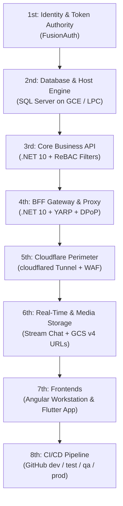

<!-- File: docs/05-implementservice.md -->
<!-- LastUpdated: 2026-09-16T19:22:00-05:00 -->

# 05 - Service Implementation Roadmap & Phased Execution Plan

## 1. Executive Implementation Sequencing: What Service Should You Build 1st?

When building a zero-trust clinical architecture, services must be implemented in a strict dependency order. You cannot build or test the BFF proxy without an API, you cannot test the API without an Identity Authority (tokens) and a Database, and you cannot secure the perimeter until the local application is functional.

---

## 2. Phased Service Breakdown: Summary & Step-by-Step Details in Plain Language

---

### Service 1 (Implement 1st): FusionAuth Identity Provider & Token Authority

#### Plain Language Summary
FusionAuth is your platform's "digital passport office." Before anything else can work, you need a system that issues secure digital identity tokens to your 4 user types (**`doctor`**, **`staff`**, **`patient`**, **`manufacturer`**) and cryptographically stamps tokens with **DPoP proof-of-possession keys** so they cannot be stolen.

#### Detailed Action Steps
1. **Deploy FusionAuth Instance**:
   - Run FusionAuth locally (via Docker/Podman or install as a local service on port `9011`) for the `dev` environment.
2. **Create the Mortho Tenant**:
   - Set up the main clinical tenant with password rules, session timeouts (60 minutes), and WebAuthn / Passkey biometric settings.
3. **Configure the 4 Standard Roles**:
   - Create roles: `doctor`, `staff`, `patient`, and `manufacturer`.
4. **Register the Applications**:
   - **App A (BFF Web Client):** Confidential client with PKCE enabled and Private Key JWT client assertion authentication.
   - **App B (Flutter Mobile/Desktop Client):** Public client with PKCE enabled and mandatory DPoP token binding.
5. **Install the JWT Populate Lambda**:
   - Add the JavaScript lambda script that automatically injects the user's `tenant_id`, `npi`, `clinical_role`, and security clearance into their access token during login.
6. **Test Token Issuance**:
   - Create 4 test user accounts (one for each role) and verify you can successfully log in and receive an Access Token with the `cnf.jkt` thumbprint attached.

---

### Service 2 (Implement 2nd): Microsoft SQL Server & Host Foundation

#### Plain Language Summary
This is your clinical vault where all patient records, surgical schedules, and implant details live. By setting this up on local fast storage using the **Shared Memory (`LPC`) protocol**, your backend can talk to the database at lightning speed (< 0.2 milliseconds) without sending data over a slow network cable.

#### Detailed Action Steps
1. **Initialize the SQL Server Database**:
   - Create the `MorthoClinical` database instance.
   - Ensure the **Shared Memory** protocol is enabled in SQL Server Configuration Manager.
2. **Enable Transparent Data Encryption (TDE)**:
   - Create the Master Key, Server Certificate, and Database Encryption Key (AES-256) so all data at rest on disk is fully encrypted for HIPAA compliance.
3. **Create the Core Tables**:
   - Create tables for: `Tenants`, `Users`, `Patients`, `SurgicalCases`, `CaseAccessGrants`, `SurgicalImplants`, and `CaseAuditLogs`.
4. **Lock Down Audit Logging**:
   - Create the `CaseAuditLogs` table and issue `DENY UPDATE, DELETE` commands so the audit records can never be tampered with by anyone.
5. **Verify Shared Memory Connection**:
   - Run a test query connecting via `Server=(local)` and confirm that `sys.dm_exec_connections` reports `Shared memory` as the transport.

---

### Service 3 (Implement 3rd): .NET 10 Core Orthopedic API

#### Plain Language Summary
This is the core brain of the platform. It holds all the business rules for orthopedic surgery, validates incoming identity tokens, checks that a doctor is only looking at their assigned surgical cases (ReBAC), and loads data from SQL Server.

#### Detailed Action Steps
1. **Create the .NET 10 Web API Project**:
   - Scaffold the API project referencing Entity Framework Core 9/.NET 10 and Microsoft SQL Server drivers.
2. **Install DPoP Authentication Middleware**:
   - Configure the API to validate incoming JWTs from FusionAuth and enforce that the incoming `DPoP` HTTP header proof matches the token's key thumbprint (`cnf.jkt`).
3. **Build Entity Framework Core DbContext with Global Query Filters**:
   - Configure automatic filtering so that:
     - A **`doctor`** can only see cases they are scheduled to operate on or consult on.
     - A **`staff`** member sees cases in their hospital facility.
     - A **`patient`** only sees their own medical record.
     - A **`manufacturer`** only sees implant specifications for cases using their hardware.
4. **Create Surgical Case Controllers**:
   - Implement endpoints: `GET /api/v1/cases/timeline`, `GET /api/v1/cases/{id}`, `POST /api/v1/cases/{id}/implants`, `POST /api/v1/cases/{id}/operative-note`.
5. **Add Immutable Audit Dispatch**:
   - Ensure every controller action automatically inserts an audit row into `CaseAuditLogs` recording who viewed or modified the case.

---

### Service 4 (Implement 4th): ASP.NET Core (.NET 10) BFF & YARP Proxy Gateway

#### Plain Language Summary
The Backend-for-Frontend (BFF) is the security bodyguard for your browser application. Instead of letting the browser touch raw identity tokens (which hackers can steal with cross-site scripting), the BFF keeps all tokens locked in server memory and only gives the browser an encrypted, tamper-proof session cookie. It then uses **YARP** to safely forward requests to the Core API.

#### Detailed Action Steps
1. **Create the .NET 10 BFF Web Project**:
   - Add packages: `Yarp.ReverseProxy`, `Duende.AccessTokenManagement.OpenIdConnect`, `Microsoft.AspNetCore.Authentication.OpenIdConnect`, and `NetEscapades.AspNetCore.SecurityHeaders`.
2. **Configure Hardened Session Cookies**:
   - Setup cookie authentication named `__Host-mortho-session` with `HttpOnly`, `SameSite=Strict`, `SecurePolicy=Always`, and a 60-minute sliding timeout.
3. **Implement OpenID Connect & PAR with FusionAuth**:
   - Configure the login handshake to use Pushed Authorization Requests (PAR) and Private Key JWT client assertions signed with an RSA-2048 private key.
4. **Configure YARP Reverse Proxy with DPoP Request Transform**:
   - Add routes in `appsettings.json` mapping `/api/**` paths to the downstream Core API.
   - Build a custom YARP request transform that intercepts the user's session cookie, grabs the stored access token, generates a fresh `ES256` DPoP proof header, and sends it to the Core API.
5. **Enforce Anti-CSRF Double Protection**:
   - Require a custom `X-CSRF: 1` header on all incoming requests to prevent cross-site request forgery.

---

### Service 5 (Implement 5th): Cloudflare Zero-Trust Edge, WAF & Tunnel

#### Plain Language Summary
Cloudflare forms the outer shield around your application. By running the **Cloudflare Tunnel (`cloudflared`)** Windows service, you can permanently close all inbound firewall ports (ports 80, 443, 1433, 3389) on your Google Cloud VM. Hackers on the internet cannot even discover your server's IP address.

#### Detailed Action Steps
1. **Set Up Cloudflare DNS & Zero Trust Account**:
   - Create your domain zone (e.g., `morthoclinical.com`) and configure strict TLS 1.3 encryption.
2. **Install `cloudflared.exe` on the Windows Host**:
   - Install the Cloudflare Tunnel agent as an automatic Windows Service.
3. **Configure the Tunnel Routes**:
   - Route `portal.morthoclinical.com` internally to `http://127.0.0.1:5000` (the BFF).
   - Route `auth.morthoclinical.com` internally to `http://127.0.0.1:9011` (FusionAuth).
4. **Close All Inbound Firewall Ports on Google Cloud**:
   - Remove all public inbound rules (port 80, 443, 1433, 3389) on the GCE VPC firewall. All ingress now flows strictly through the outbound tunnel.
5. **Enable WAF & Rate Limiting Rules**:
   - Enable OWASP Core Rule Set (CRS) at Paranoia Level 2.
   - Configure rate limiting on `/api/Account/Login` (max 5 attempts per minute before triggering a Turnstile bot challenge).

---

### Service 6 (Implement 6th): Stream Chat (HIPAA Real-Time Messaging) & GCS Scans

#### Plain Language Summary
This service handles live doctor-to-doctor messaging, operating room turnover alerts, and large clinical image files (X-rays, DICOM slices, 3D bone models) without slowing down the core database.

#### Detailed Action Steps
1. **Configure Stream Chat HIPAA Application**:
   - Set up Stream Chat and obtain API credentials.
2. **Implement Backend Token Endpoint**:
   - Build `GET /api/v1/realtime/token` in the .NET 10 API to generate short-lived Stream Chat JWTs for authenticated users.
3. **Create Channel Auto-Provisioning Logic**:
   - Automatically create collaborative channels whenever a surgical case is scheduled (e.g., `case-8921` containing the assigned `doctor`, `staff`, and `manufacturer` rep).
4. **Set Up Google Cloud Storage (GCS) Buckets**:
   - Create encrypted GCS storage buckets for clinical scans and operative note PDFs.
5. **Implement v4 Pre-Signed URL Generator**:
   - Build API endpoints that verify ReBAC permissions and generate 10-minute temporary download URLs for X-rays and 3D CAD files.

---

### Service 7 (Implement 7th): Frontends (Angular Workstation & Flutter Mobile/Desktop)

#### Plain Language Summary
Now that the entire secure backend, identity provider, and database are functional, you build the client interfaces that the clinical team actually interacts with.

#### Detailed Action Steps
1. **Build the Angular Web Workstation (Desktop UI)**:
   - Scaffold Angular 19+ application with `secureApiInterceptor` (attaching `X-CSRF: 1` and `withCredentials: true`).
   - Integrate Syncfusion Timeline Schedule for operating room suites (`OR 1`, `OR 2`, `OR 3`).
   - Integrate Syncfusion PDF Viewer for reviewing and digitally signing operative notes.
2. **Build the Flutter Cross-Platform Client (Mobile & Desktop)**:
   - Scaffold Flutter application compiled for iOS, Android, Windows, macOS, and Linux.
   - Implement biometric authentication (Face ID / Fingerprint) and generate DPoP proof keys inside the device's hardware Secure Enclave.
   - Integrate Syncfusion Flutter Charts for patient range-of-motion recovery sparklines.
   - Connect Stream Chat Flutter SDK for bedside messaging and push notifications.

---

### Service 8 (Implement 8th): GitHub CI/CD Multi-Environment Pipeline

#### Plain Language Summary
This automates testing and deployment so changes flow safely through 4 distinct stages (**`dev`** $\rightarrow$ **`test`** $\rightarrow$ **`qa`** $\rightarrow$ **`prod`**) without manual errors.

#### Detailed Action Steps
1. **Configure GitHub Environments & Secrets**:
   - Define 4 environments in the repository: `dev`, `test`, `qa`, `prod`.
   - Store environment-specific secrets (FusionAuth client IDs, Cloudflare tunnel tokens, KMS key rings).
2. **Create Build & Unit Test Workflows**:
   - Set up GitHub Actions to compile .NET 10, Angular, and Flutter on every Pull Request.
3. **Add Automated Security & Pentest Scans (DAST/SAST)**:
   - Run SonarCloud, Dependabot, and automated OWASP ZAP API vulnerability scans in the `test` and `qa` environments.
4. **Configure Automated Release Gates**:
   - Require pull request approvals and passing penetration tests before promoting builds from `qa` to `prod`.

---

## 3. Implementation Checklist & Progress Tracker

Use this checklist to track your milestone progress as you implement each service:

- [ ] **Phase 1 (Identity):** FusionAuth running, 4 roles created (`doctor`, `staff`, `patient`, `manufacturer`), DPoP token issuance tested.
- [ ] **Phase 2 (Database):** SQL Server running on NVMe, Shared Memory LPC active, TDE enabled, `CaseAuditLogs` locked.
- [ ] **Phase 3 (Core API):** .NET 10 API validating DPoP tokens, EF Core ReBAC global filters active, surgical CRUD endpoints working.
- [ ] **Phase 4 (BFF Gateway):** .NET 10 BFF managing `__Host-` session cookies, YARP reverse proxy forwarding DPoP tokens.
- [ ] **Phase 5 (Cloudflare):** `cloudflared` tunnel active, all inbound VM ports closed, WAF OWASP Level 2 enabled.
- [ ] **Phase 6 (Collaboration & Media):** Stream Chat HIPAA messaging active, GCS v4 pre-signed URL generator working.
- [ ] **Phase 7 (Client Apps):** Angular workstation running with Syncfusion OR scheduler; Flutter app running with Secure Enclave DPoP.
- [ ] **Phase 8 (DevOps):** GitHub Actions CI/CD pipelines deploying across `dev`, `test`, `qa`, and `prod`.
