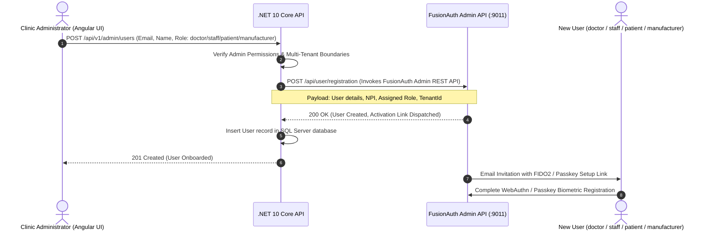

# Client Registration & Onboarding Workflows

## 1. Overview of Registered Clients (≤ 3,000 Users)

The Mortho clinical ecosystem registers two primary client types with the identity authority (FusionAuth) supporting the 4 platform roles (**`doctor`**, **`staff`**, **`patient`**, **`manufacturer`**):

```mermaid
flowchart TD
    subgraph Identity_Authority["FusionAuth / Identity Authority"]
        FA[FusionAuth Server]
    end

    subgraph Confidential_Clients["Confidential Clients"]
        BFF[BFF Web Host - .NET 10\n(Authorization Code Flow + PKCE + Private Key JWT)]
    end

    subgraph Public_Clients["Public Native Clients"]
        Mobile[Flutter Cross-Platform App\n(Authorization Code Flow + PKCE + Hardware Enclave DPoP)]
    end

    subgraph External_IdPs["Hospital Enterprise IdPs"]
        SAML[Hospital Active Directory / Okta - SAML v2]
        OIDC[Hospital Epic / Cerner - OIDC]
    end

    BFF <-->|Client Assertion + PAR| FA
    Mobile <-->|PKCE + DPoP Proof| FA
    SAML -->|Federated SSO Broker| FA
    OIDC -->|Federated SSO Broker| FA
```

---

## 2. Client Registration Specifications

### 2.1 BFF Software Client Registration (Confidential Client)
- **Role:** Web application backend host for Angular workstations.
- **Client Type:** Confidential.
- **Grant Types:** `authorization_code`, `refresh_token`.
- **Authentication Method:** Private Key JWT (`urn:ietf:params:oauth:client-assertion-type:jwt-bearer`) signed with an RSA-2048 private key.
- **PKCE:** Mandatory (`S256`).
- **Allowed Redirect URIs (Across GitHub Environments)**:
  - `dev`: `https://localhost:5001/callback`
  - `test`: `https://test-portal.morthoclinical.com/callback`
  - `qa`: `https://qa-portal.morthoclinical.com/callback`
  - `prod`: `https://portal.morthoclinical.com/callback`

### 2.2 Flutter Mobile & Desktop Client Registration (Public Client)
- **Role:** Cross-platform client on iOS, Android, Windows, macOS, Ubuntu/Linux.
- **Client Type:** Public (No embedded client secret in binary distributions).
- **Grant Types:** `authorization_code`, `refresh_token`.
- **PKCE:** Mandatory (`S256`).
- **DPoP:** Mandatory (Tokens sender-constrained to hardware key generated in device Secure Enclave / Keystore).
- **Allowed Redirect URIs:** `mortho://oauth/callback`

---

## 3. User Onboarding & Provisioning Workflow (4 Roles)

User onboarding is initiated by Clinic Administrators (`staff` or `doctor`):



---

## 4. Hospital Enterprise SSO Federation

Configured once per hospital tenant via Identity Provider connections (SAML v2 / OIDC):

1. **Enterprise Identity Provider Setup**:
   - Hospital IT creates an Enterprise Application in their directory (Microsoft Entra ID, Okta, PingFederate, or Epic EHR).
   - FusionAuth imports hospital SAML metadata or OIDC discovery endpoints.
2. **Reconcile Lambdas**:
   - Dynamically maps incoming hospital claims/groups to one of the 4 platform roles (`doctor`, `staff`, `patient`, `manufacturer`).
3. **Just-In-Time (JIT) Provisioning**:
   - Users logging in for the first time via hospital SSO have their local Mortho profile provisioned automatically with their verified hospital NPI and email.
