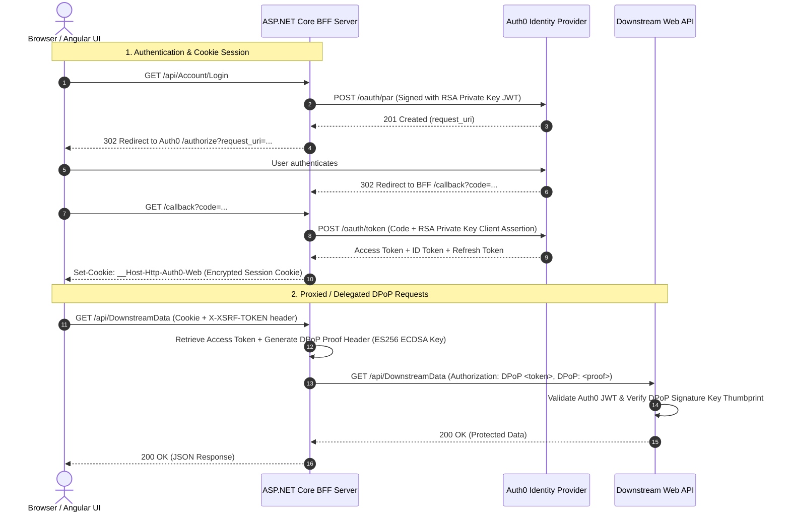

# Architectural & Security Deep-Dive Analysis: Auth0BffDpopApi

## 1. System Overview & Architectural Topology

The **Auth0BffDpopApi** repository demonstrates an enterprise-grade **Backend-For-Frontend (BFF)** security architecture for Single Page Applications (SPAs) built with **Angular**, **ASP.NET Core**, **Auth0**, and **.NET Aspire**. 

It implements high-assurance OAuth 2.0 / OIDC security profiles including:
- **Backend-For-Frontend (BFF) Pattern**: Browser never touches or stores raw Access Tokens or Refresh Tokens. All tokens reside strictly in server-side session state.
- **Demonstrating Proof-of-Possession (DPoP)** (RFC 9449): Cryptographically binds access tokens to a private key owned by the BFF, preventing token theft/replay attacks on downstream APIs.
- **Pushed Authorization Requests (PAR)** (RFC 9126): Authorization parameters are pushed directly from server-to-server to Auth0 prior to browser redirection, protecting request integrity.
- **Private Key JWT / Client Assertions** (RFC 7523): Replaces static client secrets with RSA digital signatures for authenticating the BFF client with Auth0.
- **YARP Reverse Proxy**: Transparently proxies API calls from the Angular client to downstream services.
- **.NET Aspire Orchestration**: Manages service invocation, environment bindings, telemetry, and local container/service coordination.

---

## 2. Project Component Breakdown

The repository solution ([`Auth0BffDpop.slnx`](file:///e:/Github/Damienbod/Auth0BffDpopApi/Auth0BffDpop.slnx)) comprises 5 core projects:

| Project | Target Framework / Tech | Primary Responsibility |
| :--- | :--- | :--- |
| [`bff/server/BffAuth0.Server.csproj`](file:///e:/Github/Damienbod/Auth0BffDpopApi/bff/server/BffAuth0.Server.csproj) | ASP.NET Core 9.0 | BFF host, cookie session manager, Auth0 OIDC handler, YARP proxy, DPoP token client generator. |
| [`bff/ui/`](file:///e:/Github/Damienbod/Auth0BffDpopApi/bff/ui/package.json) | Angular 19/21 + Bootstrap 5 | Standalone component SPA rendering user profile and triggering API data calls. |
| [`Api/WebApi.csproj`](file:///e:/Github/Damienbod/Auth0BffDpopApi/Api/WebApi.csproj) | ASP.NET Core 9.0 | Resource server protected by Auth0 DPoP token validation. |
| [`AppAspireHost/AppHost.cs`](file:///e:/Github/Damienbod/Auth0BffDpopApi/AppAspireHost/AppHost.cs) | .NET Aspire App Host | Distributed application builder managing microservice links, ports, environment secrets, and node execution. |
| [`GenerateCertiticate/`](file:///e:/Github/Damienbod/Auth0BffDpopApi/GenerateCertiticate/Program.cs) | .NET Console Utility | Generates self-signed RSA (2048-bit) and ECDSA (P-256) certificate PEM & JWK pairs for local dev testing. |

---

## 3. Detailed Security Implementation Analysis

### A. Authentication & Confidential Client Authorization
- **Client Assertion Generation**: In [`AssertionService.cs`](file:///e:/Github/Damienbod/Auth0BffDpopApi/bff/server/AssertionService.cs#L11-L51), the BFF creates a signed JWT assertion (`urn:ietf:params:oauth:client-assertion-type:jwt-bearer`) using an RSA private key.
- **PAR Protocol**: In [`OidcEventHandlers.cs`](file:///e:/Github/Damienbod/Auth0BffDpopApi/bff/server/OidcEventHandlers.cs#L77-L91), `OnPushAuthorization` attaches the signed assertion and audience directly into the payload pushed to Auth0's PAR endpoint.
- **PKCE**: Authorization Code Flow enforces `options.UsePkce = true` in [`Program.cs`](file:///e:/Github/Damienbod/Auth0BffDpopApi/bff/server/Program.cs#L96).

### B. DPoP (Demonstrating Proof of Possession) Setup
- **Key Generation & Algorithm**: DPoP proof generation in Auth0 requires **ES256 (ECDSA P-256)** keys.
- **Token Management Integration**: Integrated via `Duende.AccessTokenManagement.OpenIdConnect`. [`Program.cs`](file:///e:/Github/Damienbod/Auth0BffDpopApi/bff/server/Program.cs#L117-L123) parses the ECDSA key as a JWK (`DPoPProofKey`) and binds it to `AddUserAccessTokenHttpClient("dpop-api-client")`.
- **Resource Server Enforcement**: In [`Api/Program.cs`](file:///e:/Github/Damienbod/Auth0BffDpopApi/Api/Program.cs#L48-L58), `AddAuth0ApiAuthentication` is configured with `.WithDPoP(options => options.Mode = DPoPModes.Allowed)`.

### C. Browser-to-BFF Security Controls
- **Cookie Security**:
  - Cookie name: `__Host-Http-Auth0-Web` (uses `__Host-` prefix ensuring HTTPS-only, same-domain, path `/`).
  - `SameSiteMode.Lax` (or `Strict`), `HttpOnly`, `SecurePolicy = Always`.
- **Anti-CSRF Protection**:
  - Global `AutoValidateAntiforgeryTokenAttribute`.
  - Double-Submit Cookie pattern with `__Host-Http-X-XSRF-TOKEN` and `X-XSRF-TOKEN` header.
  - Angular [`secureApiInterceptor.ts`](file:///e:/Github/Damienbod/Auth0BffDpopApi/bff/ui/src/app/secure-api.interceptor.ts#L14-L19) automatically appends `X-XSRF-TOKEN` to all `/api/` requests.
- **Security Headers & CSP**:
  - Utilizes `NetEscapades.AspNetCore.SecurityHeaders`.
  - Configures strict Content-Security-Policy (CSP), `X-Frame-Options: DENY`, `X-Content-Type-Options: nosniff`, and `Referrer-Policy`.

---

## 4. Key Code Artifacts & Line References

- **BFF Authentication Registration**: [`bff/server/Program.cs:L65-L104`](file:///e:/Github/Damienbod/Auth0BffDpopApi/bff/server/Program.cs#L65-L104)
- **DPoP Token Management Setup**: [`bff/server/Program.cs:L116-L130`](file:///e:/Github/Damienbod/Auth0BffDpopApi/bff/server/Program.cs#L116-L130)
- **OIDC Event Handlers (PAR & Token Exchange)**: [`bff/server/OidcEventHandlers.cs:L13-L92`](file:///e:/Github/Damienbod/Auth0BffDpopApi/bff/server/OidcEventHandlers.cs#L13-L92)
- **JWT Client Assertion Builder**: [`bff/server/AssertionService.cs:L11-L51`](file:///e:/Github/Damienbod/Auth0BffDpopApi/bff/server/AssertionService.cs#L11-L51)
- **YARP Proxy Routes**: [`bff/server/YarpConfigurations.cs:L8-L39`](file:///e:/Github/Damienbod/Auth0BffDpopApi/bff/server/YarpConfigurations.cs#L8-L39)
- **Downstream Web API DPoP Guard**: [`Api/Program.cs:L48-L60`](file:///e:/Github/Damienbod/Auth0BffDpopApi/Api/Program.cs#L48-L60)
- **Aspire Service Coordinator**: [`AppAspireHost/AppHost.cs:L31-L76`](file:///e:/Github/Damienbod/Auth0BffDpopApi/AppAspireHost/AppHost.cs#L31-L76)

---

## 5. Critical Findings, Bugs & Areas for Guidance / Discussion

During deep analysis of the codebase, several critical items and TODOs were identified that warrant discussion:

### 1. Hardcoded Private Key Filename Mismatch (Potential Runtime Error)
- In [`bff/server/Program.cs:L55-L56`](file:///e:/Github/Damienbod/Auth0BffDpopApi/bff/server/Program.cs#L55-L56), the code reads:
  `File.ReadAllText("rsa256-private.pem")` and `File.ReadAllText("rsa256-public.pem")`
- In [`bff/server/AssertionService.cs:L18-L19`](file:///e:/Github/Damienbod/Auth0BffDpopApi/bff/server/AssertionService.cs#L18-L19), the code reads:
  `File.ReadAllText("rsa256-oidc-private.pem")` and `File.ReadAllText("rsa256-oidc-public.pem")`
- **Issue**: If the generated files are named `rsa256-private.pem` (as created by [`GenerateCertiticate/Program.cs:L32`](file:///e:/Github/Damienbod/Auth0BffDpopApi/GenerateCertiticate/Program.cs#L32)), calling `AssertionService.CreateClientToken` will throw a `FileNotFoundException` at runtime looking for `rsa256-oidc-private.pem`.

### 2. YARP Authorization Policy is Set to Anonymous
- In [`YarpConfigurations.cs:L16`](file:///e:/Github/Damienbod/Auth0BffDpopApi/bff/server/YarpConfigurations.cs#L16):
  `AuthorizationPolicy = "Anonymous"` accompanied by `// TODO fix`.
- **Impact**: Requests routed through YARP to `/api/DownstreamYarpData/...` currently bypass cookie authentication check at the BFF layer before proxying!
- **Fix Needed**: Set `AuthorizationPolicy` to a policy requiring an authenticated session (or Cookie authentication scheme), and configure a YARP transform/handler to attach the DPoP token.

### 3. UserInfo Endpoint Claims Retrieval Issue
- In [`bff/server/Program.cs:L99`](file:///e:/Github/Damienbod/Auth0BffDpopApi/bff/server/Program.cs#L99):
  `options.GetClaimsFromUserInfoEndpoint = false;`
- **Comment in README**: `TODO Debug if User info endpoint is working with private key JWT, DPoP and PAR`.
- **Context**: Auth0 requires DPoP authorization headers on the `/userinfo` endpoint when DPoP is enabled for the client/access token. Standard ASP.NET Core OIDC handler sends a standard Bearer header during sign-in, which Auth0 rejects if the token is DPoP-bound.

### 4. Transitioning Dev PEM Files to Production Secrets (Aspire / Azure KeyVault)
- In [`Program.cs`](file:///e:/Github/Damienbod/Auth0BffDpopApi/bff/server/Program.cs#L58-L60) and [`AppHost.cs`](file:///e:/Github/Damienbod/Auth0BffDpopApi/AppAspireHost/AppHost.cs#L14-L17), lines reading private keys from configuration parameters are currently commented out.
- **Guidance Needed**: Strategy for managing RSA/ECDSA private key certificates securely in production (e.g. UserSecrets, Environment variables, Azure KeyVault, or X509 store loading).

---

## 6. Next Steps & Questions for Guidance

Depending on what you would like to work on or discuss next, here are recommended topics we can explore:

1. **Fixing Key Mismatches & File Path Loading**: Standardizing certificate file loading across `Program.cs`, `AssertionService.cs`, and `GenerateCertiticate`.
2. **Implementing DPoP Token Transformer for YARP**: Wiring up `Duende.AccessTokenManagement` with YARP so reverse-proxied routes automatically attach the DPoP access token & DPoP proof header.
3. **Resolving UserInfo Endpoint with DPoP**: Implementing custom userinfo retrieval or configuring OIDC backchannel HTTP client with DPoP handler.
4. **Deploying / Testing with .NET Aspire**: Setting up local Aspire runner and validating end-to-end authentication flows with Auth0 sandbox credentials.
