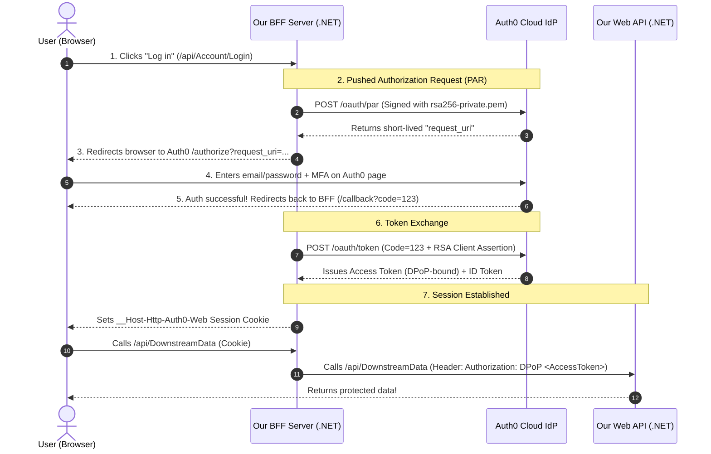

# Auth0 Explained Simply for This Application

If you're new to **Auth0**, think of Auth0 as an **External Security Guard & ID Card Printer** for your web and mobile applications.

Instead of writing code yourself to store user passwords in a database, hash passwords, handle reset emails, and build Multi-Factor Authentication (MFA), **Auth0 handles all of that for you in a secure cloud service**.

---

## 1. What Does Auth0 Do in This Architecture?

In this project, Auth0 plays 3 key roles:

```
+------------------+         1. Login Request         +------------------+
|   User Browser   | -------------------------------> |  ASP.NET Core    |
|   (Angular UI)   |                                  |   BFF Server     |
+------------------+                                  +------------------+
         ^                                                     |
         | 3. User Enters Password / MFA                       | 2. Pushes Request
         v                                                     v
+----------------------------------------------------------------+
|                          Auth0 Cloud                           |
|  - Verifies user identity (Password / Passkeys / Google / MFA) |
|  - Validates Private Key JWT Signature                         |
|  - Issues ID Token, Access Token, and Refresh Token            |
+----------------------------------------------------------------+
```

1. **User Authentication**: Displays the login screen, checks passwords, sends SMS/email MFA codes, or supports Social Login (Google, Apple, Microsoft).
2. **Client Verification**: Checks that our BFF Server is authorized to request tokens using **RSA Digital Signatures** (Private Key JWT) instead of plain passwords/secrets.
3. **Token Issuer**: Issues cryptographically signed **Access Tokens** (bound with DPoP) that give the user permission to call our downstream APIs.

---

## 2. Step-by-Step: How Auth0 Works in Code

Here is what happens under the hood when a user clicks **Log in**:



---

## 3. What You Need in the Auth0 Dashboard to Run This App

To make this project work with your own Auth0 account (a free Auth0 account works fine), you need to set up two things in [manage.auth0.com](https://manage.auth0.com):

### Item A: Create a "Web Application" in Auth0
1. Go to **Applications $\rightarrow$ Applications $\rightarrow$ Create Application**.
2. Choose **Regular Web Application** (ASP.NET Core).
3. Under **Settings**:
   - **Domain**: Copy your domain (e.g. `dev-xxxxxx.us.auth0.com`).
   - **Client ID**: Copy your Client ID (e.g. `oJ1Yg6DbJHYp6wf7Wo93ISzDi9mm54m9`).
   - **Allowed Callback URLs**: `https://localhost:7288/callback` (or your BFF server URL).
   - **Allowed Logout URLs**: `https://localhost:7288/`
4. Under **Advanced Settings $\rightarrow$ Application Credentials**:
   - Change Token Endpoint Authentication Method to **Private Key JWT**.
   - Paste the public certificate generated by `GenerateCertiticate` ([`rsa256-public.pem`](file:///e:/Github/Damienbod/Auth0BffDpopApi/rsa256-public.pem)).

### Item B: Create an "API" in Auth0
1. Go to **Applications $\rightarrow$ APIs $\rightarrow$ Create API**.
2. **Name**: `Downstream Medical API`
3. **Identifier (Audience)**: `https://api-dpop-bff` (or your custom API URI).
4. Under **Settings**: Enable **DPoP Enabled / Enforced**.

---

## 4. Where Auth0 Settings Live in the Code

| Configuration | File Location | Purpose |
| :--- | :--- | :--- |
| **Auth0 Domain & ClientId** | [`bff/server/appsettings.Development.json`](file:///e:/Github/Damienbod/Auth0BffDpopApi/bff/server/appsettings.Development.json) | Tells the BFF which Auth0 tenant to talk to. |
| **OIDC Registration** | [`bff/server/Program.cs:L78-L103`](file:///e:/Github/Damienbod/Auth0BffDpopApi/bff/server/Program.cs#L78-L103) | Registers Auth0 OIDC handler with PAR and PKCE. |
| **API Audience Guard** | [`Api/Program.cs:L48-L58`](file:///e:/Github/Damienbod/Auth0BffDpopApi/Api/Program.cs#L48-L58) | Validates Auth0 tokens and DPoP headers on the Web API. |
| **Aspire Host Config** | [`AppAspireHost/AppHost.cs:L19-L23`](file:///e:/Github/Damienbod/Auth0BffDpopApi/AppAspireHost/AppHost.cs#L19-L23) | Passes Auth0 environment variables into containers/services. |
