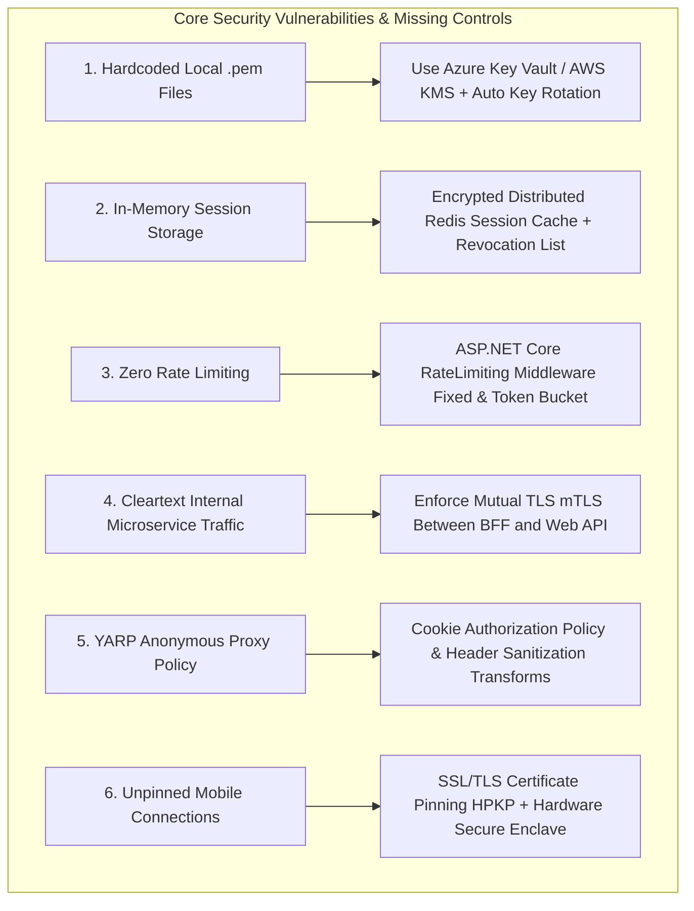

# Pure Technical Security Analysis & Defenses: Auth0BffDpopApi

This document provides a pure technical application security, infrastructure, identity, and cryptographic assessment of the **Auth0BffDpopApi** codebase.

---

## 1. Existing Security Strengths in the Codebase

| Security Mechanism | Specification | Defense Provided |
| :--- | :--- | :--- |
| **Backend-For-Frontend (BFF) Pattern** | ASP.NET Core session handling | Complete elimination of client-side token storage in `localStorage` / `sessionStorage`. Immune to XSS token theft. |
| **OAuth DPoP (RFC 9449)** | ECDSA P-256 (ES256) key binding | Access tokens are sender-constrained. Stolen tokens cannot be replayed on downstream APIs without the private key. |
| **OAuth PAR (RFC 9126)** | Server-to-server parameter push | Authorization parameters are pushed to Auth0 prior to browser redirect, preventing URL parameter tampering. |
| **Private Key JWT (RFC 7523)** | RSA 2048-bit digital signatures | Replaces static client secrets with private key client assertions for Auth0 client authentication. |
| **Cookie Hardening** | `__Host-Http-Auth0-Web` | `SameSite=Lax/Strict`, `HttpOnly`, `Secure` flags enforced for session cookies. |
| **Anti-CSRF Protection** | Double-Submit Cookie pattern | `AutoValidateAntiforgeryTokenAttribute` and `X-XSRF-TOKEN` header validation on all state-modifying routes. |

---

## 2. Critical Pure Technical Security Gaps (What is Missing)

The following 6 technical security controls are missing from the codebase and must be implemented before deploying to production:

### 1. Key Management & Vault Integration (Hardware Security)
- **Current State**: RSA (`rsa256-private.pem`) and ECDSA (`ecdsa256-private.pem`) private keys are stored on local disk ([Program.cs:L55](file:///e:/Github/Damienbod/Auth0BffDpopApi/bff/server/Program.cs#L55) & [AssertionService.cs:L18](file:///e:/Github/Damienbod/Auth0BffDpopApi/bff/server/AssertionService.cs#L18)).
- **Missing Defense**: Integration with **Hardware Security Modules (HSM)**, **Azure Key Vault**, or **AWS KMS**. Automated key rotation policies must be implemented to rotate signing keys without application downtime.

### 2. Encrypted Distributed Session Store & Revocation System
- **Current State**: Sessions reside in-memory. If a session cookie is stolen or a user's account is compromised, there is no centralized mechanism to immediately revoke active sessions.
- **Missing Defense**: Distributed Redis session cache encrypted via **ASP.NET Core Data Protection API** (`PersistKeysToAzureBlobStorage` / `AWS S3`) with real-time session revocation lists (SRL).

### 3. Rate Limiting & Throttling (DoS & Automated Attack Defense)
- **Current State**: Zero rate limiting is configured on endpoints like `/api/Account/Login`, `/api/User`, or Auth0 callbacks.
- **Missing Defense**: Enforce `Microsoft.AspNetCore.RateLimiting` middleware (Fixed Window & Token Bucket rate limiters) to protect login endpoints against credential stuffing, automated scraping, and brute force attacks.

### 4. Zero-Trust Network & Mutual TLS (mTLS) Between Microservices
- **Current State**: Traffic between the BFF server and downstream Web API relies on HTTPS without server-to-server client authentication.
- **Missing Defense**: Implement **mTLS (Mutual TLS)** via service mesh (Linkerd / Istio) or X.509 client certificates between BFF and Web API so unauthorized internal network traffic cannot reach internal endpoints.

### 5. YARP Reverse Proxy Authorization & Header Stripping Defenses
- **Current State**: In [YarpConfigurations.cs:L16](file:///e:/Github/Damienbod/Auth0BffDpopApi/bff/server/YarpConfigurations.cs#L16), proxied routes default to `AuthorizationPolicy = "Anonymous"`. Additionally, YARP does not strip internal proxy headers (`X-Forwarded-For`, `X-Forwarded-Host`) which can lead to IP spoofing.
- **Missing Defense**: Enforce `AuthorizationPolicy = "CookieAuthenticated"` on all YARP routes and configure explicit YARP header transforms to sanitize incoming headers.

### 6. Mobile Certificate Pinning & Secure Enclave Hardening
- **Current State**: The repository focuses on the web BFF, but does not specify mobile network security defenses.
- **Missing Defense**: Mobile native apps MUST implement **SSL/TLS Certificate Pinning (HPKP)** to mitigate Man-in-the-Middle (MitM) attacks via user-installed proxy CA certificates (e.g. Charles Proxy / Burp Suite), and generate DPoP keys exclusively inside the **Hardware Secure Enclave** (iOS Keychain) or **Android Keystore System**.

---

## 3. Recommended Remediation Priority Matrix

| Priority | Security Control | Target Component | File Reference |
| :---: | :--- | :--- | :--- |
| **P0 (Critical)** | Secure YARP Proxy Route Authorization | BFF Server | [YarpConfigurations.cs](file:///e:/Github/Damienbod/Auth0BffDpopApi/bff/server/YarpConfigurations.cs#L16) |
| **P0 (Critical)** | Fix Hardcoded Pem File Paths Mismatch | BFF Server | [Program.cs](file:///e:/Github/Damienbod/Auth0BffDpopApi/bff/server/Program.cs#L55) & [AssertionService.cs](file:///e:/Github/Damienbod/Auth0BffDpopApi/bff/server/AssertionService.cs#L18) |
| **P1 (High)** | Azure KeyVault / AWS KMS Private Key Integration | BFF Server & AppHost | [AppHost.cs](file:///e:/Github/Damienbod/Auth0BffDpopApi/AppAspireHost/AppHost.cs#L14-L17) |
| **P1 (High)** | Add ASP.NET Core Rate Limiting Middleware | BFF Server & Web API | [Program.cs](file:///e:/Github/Damienbod/Auth0BffDpopApi/bff/server/Program.cs) |
| **P2 (Medium)** | Encrypted Distributed Redis Session Store | BFF Server | [Program.cs](file:///e:/Github/Damienbod/Auth0BffDpopApi/bff/server/Program.cs#L71) |
| **P2 (Medium)** | Server-to-Server mTLS Enforcement | Web API | [Api/Program.cs](file:///e:/Github/Damienbod/Auth0BffDpopApi/Api/Program.cs) |
